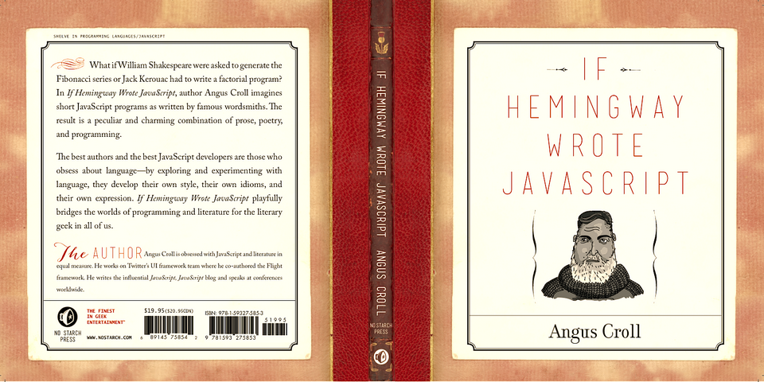

# Authors Writing JavaScript

## [Now a Book!](http://anguscroll.com/hemingway)

Recently I had a dream in which I set homework assignments for Ernest Hemingway and twenty-four other literary luminaries. Each author received one of five tasks--common coding problems, mostly mathematical--which they were to solve using JavaScript.

To my astonishment, after a few days, completed assignments started arriving in my mailbox. Still more remarkable, with the exception of Kafka's accursed effort, they all seemed to work.

Naturally this was all too good to keep to myself so I've reproduced their solutions in this book. To help put the answers in context, I've written a short biography of each author, and followed their code with a brief explanation of what I think they were up to. As a respite between assignments I've included some poetic interludes: long forgotten odes documenting their author's struggle with everyone's favorite programming language.

See also [my JSConf presentation](https://speakerdeck.com/anguscroll/javascript-is-literature-is-javascript) and feel free to add your own pull requests as the inspiration takes you!

---

## Getting Started

> Using a browser with good DevTools will make your life easier: [Chromium](http://www.chromium.org/getting-involved/download-chromium), [FireFox](https://www.mozilla.org/en-US/firefox/new/), [Edge](https://www.microsoft.com/edge), [Chrome](https://www.google.com/chrome/)

1. Install OR update the `study-lenses` package globally
   - `$ npm install -g study-lenses` (if you do not have it already)
   - `$ npm update -g study-lenses` (if you already have it installed)
2. Clone this repository:
   - `$ git clone git@github.com:HackYourFutureBelgium/welcome-to-js.git`
3. Navigate to the module repository in terminal
   - `$ cd if-hemingway`
4. Run the `study` command from your CLI
   - `$ study`
5. The material will open in your default browser, you're good to go!
   - you can read the `study-lenses` user guide from your browser by navigating to `localhost:3000?--help`

> If you have a windows computer and get this error:
>
> - `... /study.ps1 cannot be loaded because running scripts ...`
>
> follow the instructions in [this StackOverflow answer](https://stackoverflow.com/a/63424744), that should take care of it ; )
